```{r setup, include=FALSE}
knitr::opts_chunk$set(echo = TRUE)
```

# Amazon

### Data Fetching : 
Stock data for two companies, Amazon (AMZN) and Google (GOOGL), are fetched from Yahoo Finance for the period from January 1, 2010, to June 14, 2021.


### Fetching Amazon stock data

```
require(xts)
require(quantmod)
getSymbols.warning4.0=FALSE
AMZN <- getSymbols(Symbols = "AMZN", src = "yahoo", 
                   from = "2010-01-01", to = "2021-06-14", auto.assign = FALSE)
tail(AMZN)
```
```
AMZN.Open AMZN.High AMZN.Low AMZN.Close AMZN.Volume AMZN.Adjusted
2021-06-04  160.6000  161.0500 159.9405   160.3110    44994000      160.3110
2021-06-07  159.8665  160.4000 158.6100   159.9005    44316000      159.9005
2021-06-08  161.1305  163.9765 160.9005   163.2055    68334000      163.2055
2021-06-09  163.6435  164.8790 163.5350   164.0575    49110000      164.0575
2021-06-10  164.1005  167.5500 164.0575   167.4825    69530000      167.4825
2021-06-11  167.4825  168.3290 166.6725   167.3415    56348000      167.3415
```

### Fetching Google stock data

```
require(xts)
require(quantmod)
getSymbols.warning4.0=FALSE
```

```
GOOGL <- getSymbols(Symbols = "GOOGL", src = "yahoo",
                    from = "2010-01-01", to = "2021-06-14", auto.assign = FALSE)
tail(GOOGL)
```

```
           GOOGL.Open GOOGL.High GOOGL.Low GOOGL.Close GOOGL.Volume GOOGL.Adjusted
2021-06-04   118.4635   119.9515  118.1205    119.6785     24458000       119.6785
2021-06-07   119.4720   120.2255  119.0500    120.1150     24120000       120.1150
2021-06-08   120.6005   120.9760  119.7390    119.9220     24240000       119.9220
2021-06-09   120.5715   120.6440  119.8450    120.3970     17942000       120.3970
2021-06-10   120.3460   121.8000  120.1890    121.7565     25904000       121.7565
2021-06-11   122.0000   122.0860  120.9480    121.5100     21958000       121.5100
```
### Data Preprocessing: 
The closing prices of the stocks were extracted and converted into logarithmic returns. The differencing technique was applied to obtain the differenced log returns.

### Data preprocessing for Amazon
```
AMZN_closing <- Cl(to.daily(AMZN))
AMZN_dc <- Cl(to.monthly(AMZN))
AMZN_log <- log(AMZN_closing)
AMZN_diff <- diff(AMZN_log, lag = 1)
anyNA(AMZN_diff)
colSums(is.na(AMZN_diff))
AMZN_diff <- AMZN_diff[!is.na(AMZN_diff)]
```


### Data preprocessing for Google
```
GOOGL_closing <- Cl(to.daily(GOOGL))
GOOGL_dc <- Cl(to.monthly(GOOGL))
GOOGL_log <- log(GOOGL_closing)
GOOGL_diff <- diff(GOOGL_log, lag = 1)
anyNA(GOOGL_diff)
colSums(is.na(GOOGL_diff))
GOOGL_diff <- GOOGL_diff[!is.na(GOOGL_diff)]
```

### Plottings: 
Several plots were generated to visualize the data. For both AMZN and GOOGL, plots of the log returns and differenced log returns were created. These plots provide insights into the volatility and trends present in the stock prices.

### Plottings for Amazon

```
plot(AMZN_log, main = "AMZN log returns")
```
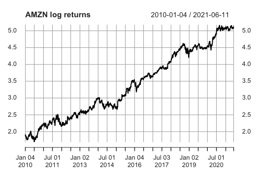

```
plot(AMZN_diff, type = "l", main = "AMZN diff") 
```

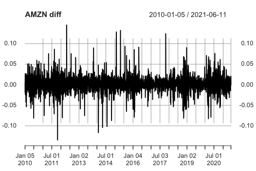


### Plottings for Google
```
plot(GOOGL_dc)
plot(GOOGL_log, main = "GOOGL log returns")
plot(GOOGL_diff, type = "l", main = "GOOGL diff")
```


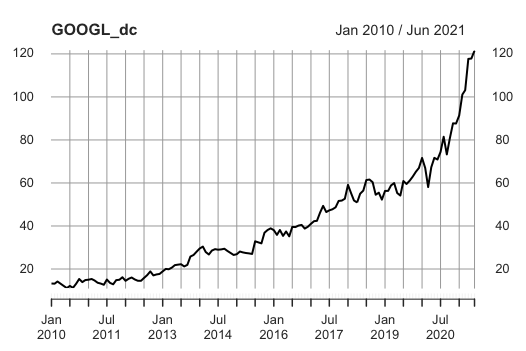
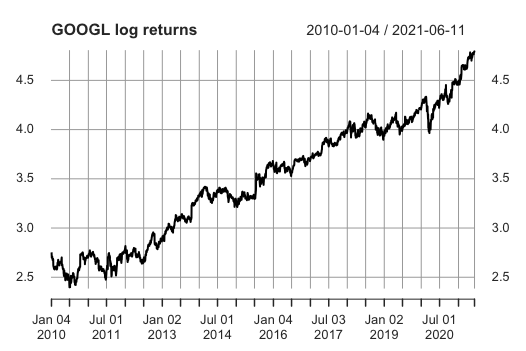
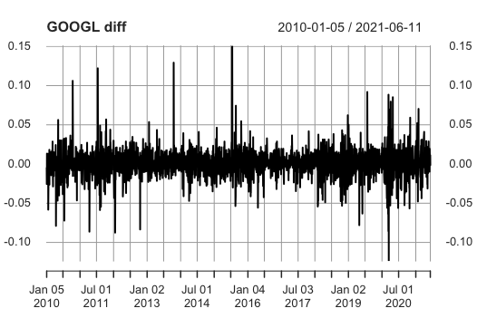

### ACF & PACF:
Autocorrelation function (ACF) and partial autocorrelation function (PACF) plots were generated for the differenced log returns of both AMZN and GOOGL. These plots help identify the potential order of autoregressive and moving average terms in the ARIMA models.

### ACF and PACF for Amazon
```
require(astsa)
acf2(AMZN_diff, max.lag = 30)
```
```
     [,1]  [,2]  [,3]  [,4] [,5]  [,6] [,7]  [,8] [,9] [,10] [,11] [,12] [,13]
ACF  -0.03 -0.01 -0.02 -0.02 0.01 -0.01 0.02 -0.05 0.02 -0.01 -0.01 -0.01 -0.02
PACF -0.03 -0.01 -0.02 -0.02 0.01 -0.01 0.02 -0.05 0.02 -0.01 -0.01 -0.02 -0.02
     [,14] [,15] [,16] [,17] [,18] [,19] [,20] [,21] [,22] [,23] [,24] [,25] [,26]
ACF  -0.02 -0.03  0.03  0.02  0.02  0.01 -0.01 -0.02 -0.03  0.04     0 -0.02 -0.01
PACF -0.03 -0.03  0.02  0.02  0.02  0.01  0.00 -0.02 -0.03  0.03     0 -0.02 -0.01
     [,27] [,28] [,29] [,30]
ACF   0.01     0 -0.03 -0.02
PACF  0.01     0 -0.03 -0.02
```
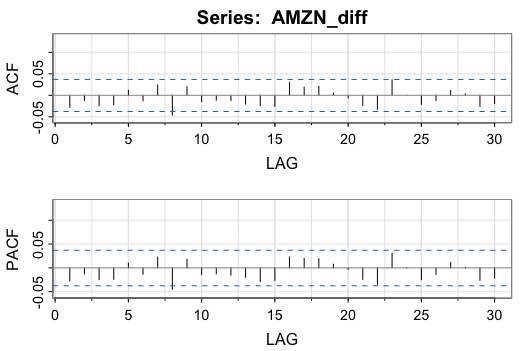

### ACF and PACF for Google
```
require(astsa)
acf2(GOOGL_diff, max.lag = 30)
```
```
     [,1] [,2]  [,3] [,4]  [,5]  [,6] [,7]  [,8] [,9] [,10] [,11] [,12] [,13]
ACF  -0.05 0.02 -0.01    0 -0.01 -0.04 0.06 -0.07 0.05 -0.01 -0.02  0.02 -0.04
PACF -0.05 0.02 -0.01    0 -0.01 -0.04 0.05 -0.06 0.04  0.00 -0.02  0.02 -0.04
     [,14] [,15] [,16] [,17] [,18] [,19] [,20] [,21] [,22] [,23] [,24] [,25] [,26]
ACF   0.01 -0.03  0.04  0.02  0.02  0.00 -0.03  0.00 -0.07  0.01 -0.02 -0.01 -0.04
PACF  0.00 -0.02  0.03  0.03  0.03 -0.01 -0.02 -0.01 -0.06  0.00 -0.01 -0.02 -0.04
     [,27] [,28] [,29] [,30]
ACF   0.01  0.04 -0.04 -0.02
PACF  0.00  0.03 -0.02 -0.03
```

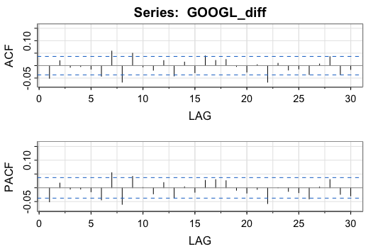

### ARIMA Modeling: 

ARIMA models were fitted to the differenced log returns of AMZN and GOOGL. The models were tested with different combinations of autoregressive (AR), integrated (I), and moving average (MA) terms. The SARIMA function from the "astsa" package was used for modeling.

### ARIMA Model for Amazon
```
Res <- sarima(AMZN_diff,0,0,0)
```

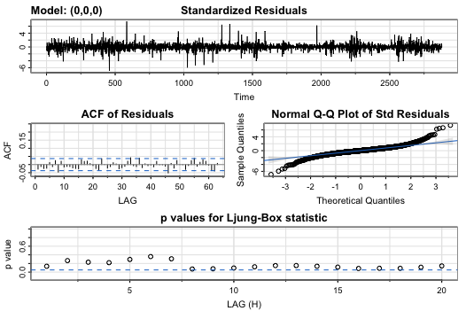

```
AMZN_fit1 <- sarima(AMZN_diff,0,1,0)
```

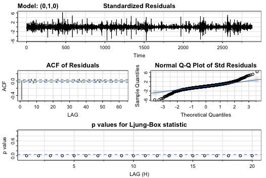

```
AMZN_fit2 <- sarima(AMZN_diff,0,0,1)
```

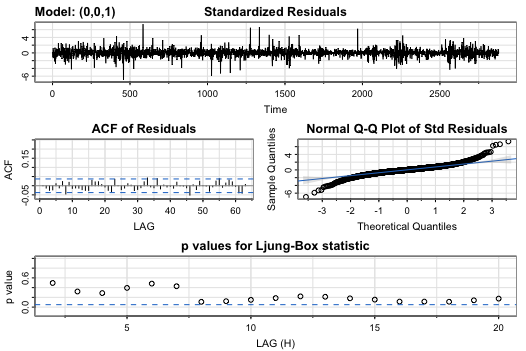

```
AMZN_fit3 <- sarima(AMZN_diff,1,0,0)
```


### Apply model

```
arima_log <- arima(AMZN_log, order = c(0,1,0))
```
```
sarima(AMZN_log, 0,1,0)
```


### ARIMA Model for Google
```
Res <- sarima(GOOGL_diff, 0, 0, 0)
```
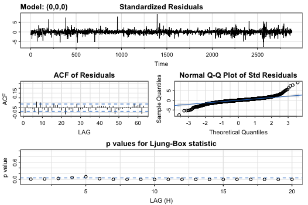
```
G_fit1 <- sarima(GOOGL_diff, 0, 1, 0)
```
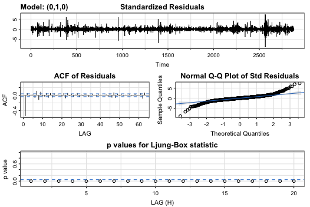
```
G_fit2 <- sarima(GOOGL_diff, 0, 0, 1)
```
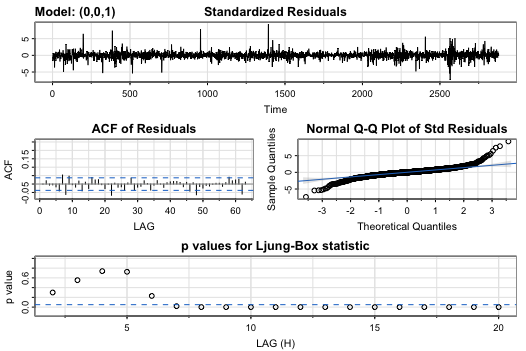

```
G_fit3 <- sarima(GOOGL_diff, 1, 0, 0)
```
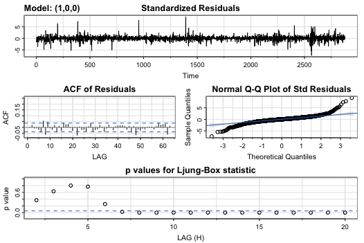

# Apply model
```
sarima(GOOGL_log, 0, 1, 0)
```

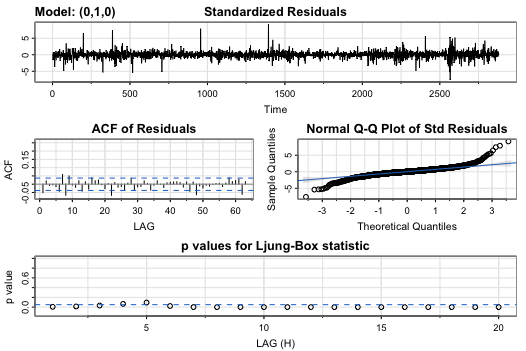


### Forecasting: 
SARIMA models were used to forecast the log returns for the next 24 periods for both AMZN and GOOGL. These forecasts provide an estimate of the future behavior of the stock prices based on the historical data

### Forecasting for Amazon

```
sarima.for(AMZN_log, n.ahead = 24,0,1,0)
```
```
Time Series:
Start = 2881 
End = 2904 
Frequency = 1 
 [1] 5.121155 5.122273 5.123391 5.124509 5.125627 5.126745 5.127863 5.128981
 [9] 5.130099 5.131217 5.132334 5.133452 5.134570 5.135688 5.136806 5.137924
[17] 5.139042 5.140160 5.141278 5.142396 5.143514 5.144632 5.145750 5.146868

$se
Time Series:
Start = 2881 
End = 2904 
Frequency = 1 
 [1] 0.01976214 0.02794788 0.03422903 0.03952428 0.04418949 0.04840716 0.05228571
 [8] 0.05589577 0.05928642 0.06249337 0.06554360 0.06845806 0.07125341 0.07394315
[15] 0.07653844 0.07904856 0.08148139 0.08384365 0.08614117 0.08837897 0.09056150
[22] 0.09269265 0.09477589 0.09681431
```

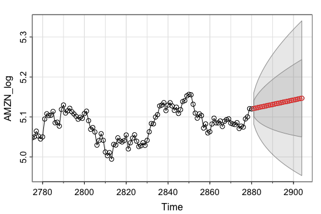

```
require(forecast)
summary(arima_log)
```

```
Call:
arima(x = AMZN_log, order = c(0, 1, 0))


sigma^2 estimated as 0.0003918:  log likelihood = 7207.44,  aic = -14412.87

Training set error measures:
                      ME       RMSE        MAE        MPE      MAPE      MASE
Training set 0.001118256 0.01979033 0.01377054 0.03204543 0.4547713 0.9997007
                    ACF1
Training set -0.02780339
```


### Forecasting for Google
```
sarima.for(GOOGL_log, n.ahead = 24, 0, 1, 0)
```

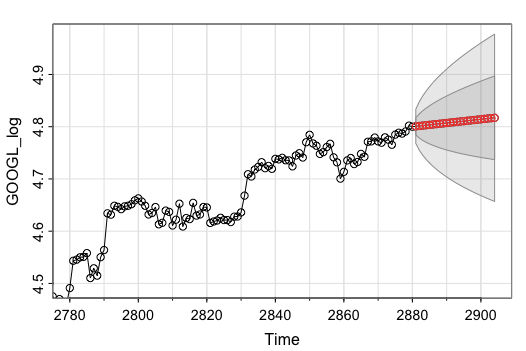

```
require(forecast)
summary(arima_log)
```
```
arima(x = AMZN_log, order = c(0, 1, 0))


sigma^2 estimated as 0.0003918:  log likelihood = 7207.44,  aic = -14412.87

Training set error measures:
                      ME       RMSE        MAE        MPE      MAPE      MASE
Training set 0.001118256 0.01979033 0.01377054 0.03204543 0.4547713 0.9997007
                    ACF1
Training set -0.02780339
```
### Summary Statistics: 
Summary statistics were calculated for the ARIMA model fitted to the log returns of AMZN. The mean error (ME), root mean squared error (RMSE), mean absolute error (MAE), mean percentage error (MPE), mean absolute percentage error (MAPE), mean absolute scaled error (MASE), and the first-order autocorrelation coefficient (ACF1) were reported


